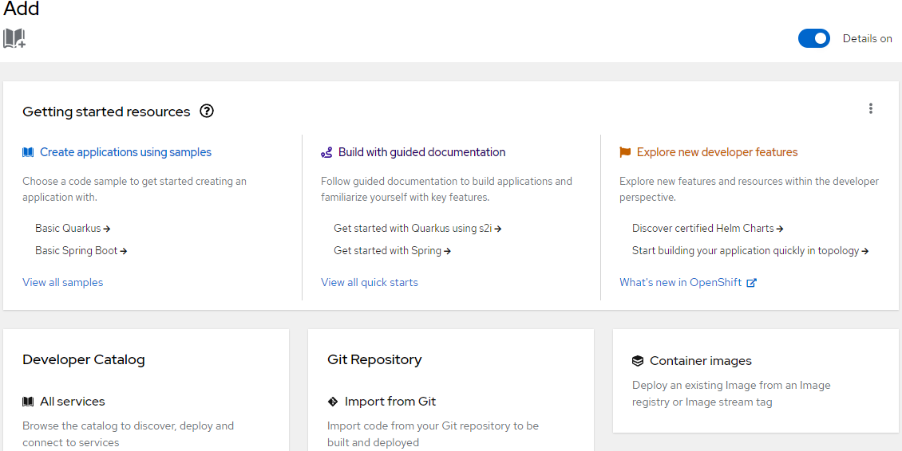

# Optional: Deploy guestbook app from the OpenShift internal registry

## Objectives
In this lab, you will:

- Build and deploy a simple guestbook application
- Use OpenShift image streams to roll out an update
- Deploy a multi-tier version of the guestbook application

## Pre-requisite
You must have built and pushed the Guestbook application using the Docker commands as given in the Final Assignment.

## Deploy guestbook app from the OpenShift internal registry

As discussed in the course, IBM Cloud Container Registry scans images for common vulnerabilities and exposures to 
ensure that images are secure. But OpenShift also provides an internal registry – recall the discussion of image streams and 
image stream tags. Using the internal registry has benefits too. For example, there is less latency when pulling images for 
deployments. What if we could use both—use IBM Cloud Container Registry to scan our images and then automatically import those images 
to the internal registry for lower latency?

## Please continue with the below commands from the steps where you left off in the previous lab.

1. Create an image stream that points to your image in IBM Cloud Container Registry.
```
oc tag us.icr.io/$MY_NAMESPACE/guestbook:v1 guestbook:v1 --reference-policy=local --scheduled
```

With the `--reference-policy=local` option, a copy of the image from IBM Cloud Container Registry is imported into the local cache 
of the internal registry and made available to the cluster’s projects as an image stream. The `--schedule` option sets up 
periodic importing of the image from IBM Cloud Container Registry into the internal registry. The default frequency is 15 minutes.


Now let’s head over to the OpenShift web console to deploy the guestbook app using this image stream

2. Click on the `Skills Network Tool` and select `Cloud` which will open a drop-down. Click on `Open OpenShift` console which will open 
the Open Shift Web console in a new window.

3. From the Developer perspective, click the **+Add button** to add a new application to this project.


4. Click the **Container Image** option so that we can deploy the application using an image in the internal registry.


5. Under Image, switch to **“Image stream tag from internal registry“**.

6. Select your project, and the image stream and tag you just created (`guestbook` and `v1`, respectively). 
You should have only have one option for each of these fields anyway since you only have access to a single project and 
you only created one image stream and one image stream tag.

7. Keep all the default values and hit **Create** at the bottom. This will create the application and take you to the Topology view.

8. From the Topology view, click the `guestbook` Deployment. This should take you to the **Resources** tab for this Deployment, where you can see the Pod that is running the application as well as the Service and Route that expose it.
Kindly wait as the deployments in the Topology view may take time to get running.


