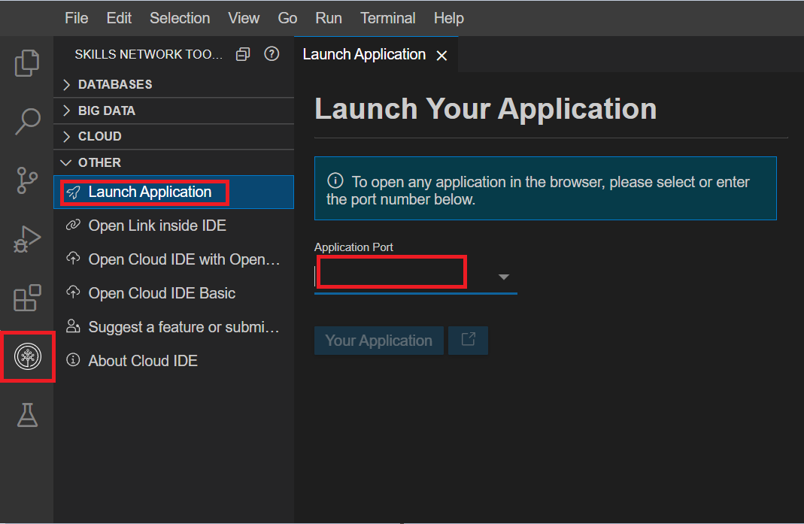

# Final Project

## Objectives

In this lab, you will:

- Build and deploy a simple Guestbook application
- Autoscale the Guestbook application using Horizontal Pod Autoscaler
- Perform Rolling Updates and Rollbacks

## Project Overview

## Guestbook application

Guestbook is a simple web application that we will build and deploy with Docker and Kubernetes. 
The application consists of a web front end which will have a text input where you can enter any text and submit. 
For all of these we will create Kubernetes Deployments and Pods. 
Then we will apply Horizontal Pod Scaling to the Guestbook application and finally work on Rolling Updates and Rollbacks..

# Verify the environment and command line tools

1.  If a terminal is not already open, open a terminal window by using the menu in the editor: `Terminal > New Terminal`.</br>


2.  Change to your project folder.
```
cd /home/project
```

3.  Clone the git repository that contains the artifacts needed for this lab.
```
[ ! -d 'guestbook' ] && git clone https://github.com/ibm-developer-skills-network/guestbook
```

4.  Change to the directory for this lab.
```
cd guestbook
```

5.  List the contents of this directory to see the artifacts for this lab.
```
ls
```

## Build the guestbook app

To begin, we will build and deploy the web front end for the guestbook app.

1.  Change to the `v1/guestbook` directory.
```
cd v1/guestbook
```

2. Dockerfile incorporates a more advanced strategy called multi-stage builds, so feel free to read more about that [here](https://docs.docker.com/develop/develop-images/multistage-build/).
Complete the Dockerfile with the necessary Docker commands to build and push your image. The path to this file is `guestbook/v1/guestbook/Dockerfile`.	
```
cat Dockerfile
```
## Hint
The FROM instruction initializes a new build stage and specifies the base image that subsequent instructions will build upon.
The COPY command enables us to copy files to our image. The ADD command is used to copy files/directories into a Docker image. The RUN instruction executes commands.
The EXPOSE instruction exposes a particular port with a specified protocol inside a Docker Container.
The CMD instruction provides a default for executing a container, or in other words, an executable that should run in your container.

Copy the code of the completed dockerfile with you. You will be prompted to submit it in the text box in the Peer Assignment.

3.  Export your namespace as an environment variable so that it can be used in subsequent commands.
```
export MY_NAMESPACE=sn-labs-$USERNAME
```

4.  Build the guestbook app using the Docker Build command.
```
docker build . -t us.icr.io/$MY_NAMESPACE/guestbook:v1
```

5.  Push the image to IBM Cloud Container Registry.
```
docker push us.icr.io/$MY_NAMESPACE/guestbook:v1
```

6.  Verify that the image was pushed successfully.
```
ibmcloud cr images
```


7. Open the `deployment.yml` file in the `v1/guestbook` directory & view the code for the deployment of the application:
```
cat deployment.yml
```
Note: Replace `<your sn labs namespace>` with your SN labs namespace. 
To check your SN labs namespace, please run the command `ibmcloud cr namespaces`.

8. Apply the deployment using:
```
kubectl apply -f deployment.yml
```

9. Open a New Terminal and enter the below command to view your application:
```
kubectl port-forward deployment.apps/guestbook 3000:3000
```

10. Launch your application on port 3000. Click on the Skills Network button on the right, it will open 
the **“Skills Network Toolbox”**. Then click the **Other** then **Launch Application**. From there you should 
be able to enter the port and launch.<br>


11. Now you should be able to see your running application. Please copy the app URL which will be given as below:


12. Try out the guestbook by putting in a few entries. You should see them appear above the input box after you hit **Submit**.

## Autoscale the Guestbook application using Horizontal Pod Autoscaler

1. Autoscale the Guestbook deployment using `kubectl autoscale deployment`
```
kubectl autoscale deployment guestbook --cpu-percent=5 --min=1 --max=10
```

You can check the current status of the newly-made HorizontalPodAutoscaler, by running:
```
kubectl get hpa guestbook
```


2. Open another new terminal and enter the below command to generate load on the app to observe the autoscaling 
(Please ensure your port-forward command is running. In case you have stopped your application, please run the port-forward 
command to re-run the application at port 3000.)
```
kubectl run -i --tty load-generator --rm --image=busybox:1.36.0 --restart=Never -- /bin/sh -c "while sleep 0.01; do wget -q -O- https://aruszcz-3000.theiaopenshift-1-labs-prod-theiaopenshift-4-tor01.proxy.cognitiveclass.ai/; done"
```

3. Run the below command to observe the replicas increase in accordance with the autoscaling:
```
kubectl get hpa guestbook --watch
```

4. Run the above command again after 5-10 minutes and you will see an increase in the number of replicas which shows that your application has been autoscaled.


5. Run the below command to observe the details of the horizontal pod autoscaler:
```
kubectl get hpa guestbook
```

## Perform Rolling Updates and Rollbacks on the Guestbook application

Note: Please run all the commands in the 1st terminal unless mentioned to use a new terminal.

1. Please update the title and header in `index.html` to any other suitable title and header 
like `<Your name> Guestbook - v2` & `Guestbook - v2`.

2. Run the below command to build and push your updated app image:
```
docker build . -t us.icr.io/$MY_NAMESPACE/guestbook:v1 && docker push us.icr.io/$MY_NAMESPACE/guestbook:v1
```


3. Update the values of the CPU in the `deployment.yml` to **cpu: 5m** and **cpu: 2m**:

4. Apply the changes to the deployment.yml file.
```
kubectl apply -f deployment.yml
```


5. Open a new terminal and run the port-forward command again to start the app:
```
kubectl port-forward deployment.apps/guestbook 3000:3000

```

6. Launch your application on port 3000. Click on the Skills Network button on the right, it will open the **“Skills Network Toolbox”**. 
Then click the **Other** then **Launch Application**. From there you should be able to enter the port and launch.


7. You will notice the updated app content as below:


8. Run the below command to see the history of deployment rollouts:
```
kubectl rollout history deployment/guestbook
```

9. Run the below command to see the details of Revision of the deployment rollout:
```
kubectl rollout history deployments guestbook --revision=2
```


10. Run the below command to get the replica sets and observe the deployment which is being used now:
```
kubectl get rs
```

11. Run the below command to undo the deploymnent and set it to Revision 1:
```
kubectl rollout undo deployment/guestbook --to-revision=1
```
